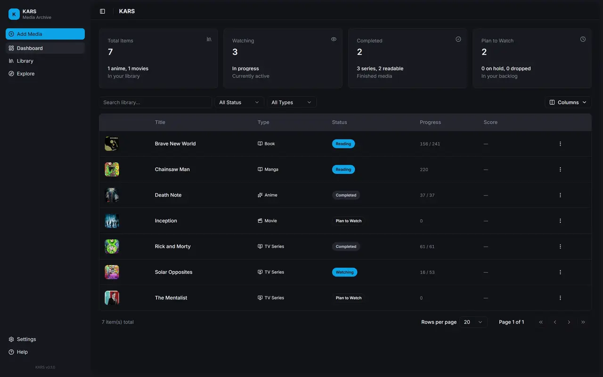
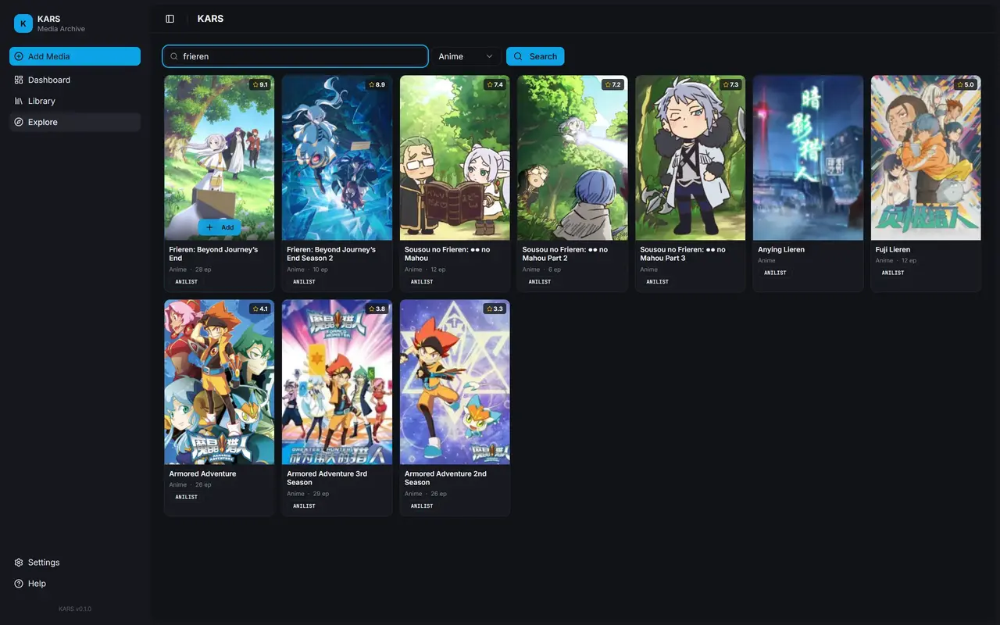

# KARS - Media Tracker

A self-hosted media tracking application for movies, TV series, anime, manga, and books. Single binary deployment with an embedded web dashboard.

  

## Features

- **Track** movies, TV series, anime, manga, light novels, and books
- **Search** external APIs: AniList, TMDB, MangaDex, Open Library
- **Dashboard** with stats cards, sortable data table, and quick filters
- **CRUD** — add, edit, delete items from your library
- **Single binary** — frontend embedded, zero runtime dependencies
- **Dual database** — local SQLite or remote [Turso](https://turso.tech)

## Screenshots

[](assets/dashboard.webp)

[](assets/explore.webp)

## Development

Setup:

```bash
git clone https://github.com/recregt/kars.git
cd kars
cp .env.example .env
```

Then run backend and frontend at the same time in separate terminals.

Terminal 1 (Backend):

```bash
cargo run -p kars -- --web
```

Terminal 2 (Frontend):

```bash
cd frontend
pnpm install
pnpm dev
```

Note: In local SQLite mode, `data/` is created automatically on first run.

- Frontend: http://localhost:3000
- API: http://localhost:3001/api

## Production

See [docs/production.md](docs/production.md) for build instructions, [docs/server-setup.md](docs/server-setup.md) for server configuration, and [docs/auth.md](docs/auth.md) for access control guidance.

## Authentication & Access Control

> [!WARNING]
> **Identity & Access Management:** KARS is designed as a focused media engine and **does not** implement an internal authentication layer. 
> 
> Deploying KARS to a public-facing IP without an Identity-Aware Proxy (IAP) or VPN will expose your database to unauthorized access. It is **strongly recommended** to use [Cloudflare Zero Trust](docs/auth.md), Authelia, or Tailscale to secure your deployment.

## API Endpoints

| Method | Path | Description |
|--------|------|-------------|
| `GET` | `/api/items` | List all items |
| `POST` | `/api/items` | Create item |
| `GET` | `/api/items/:id` | Get item by ID |
| `PUT` | `/api/items/:id` | Update item |
| `DELETE` | `/api/items/:id` | Delete item |
| `GET` | `/api/search?q=` | Search library |
| `GET` | `/api/explore?q=&type=` | Search external APIs |
| `GET` | `/api/stats` | Library statistics |

## Environment Variables

| Variable | Default | Description |
|----------|---------|-------------|
| `DATABASE_MODE` | `local` | `local` or `turso` |
| `DATABASE_PATH` | `data/kars.db` | SQLite path (local mode) |
| `TURSO_DATABASE_URL` | — | Turso connection URL |
| `TURSO_AUTH_TOKEN` | — | Turso auth token |
| `PORT` | `3001` | Server port |
| `TMDB_API_KEY` | — | TMDB API key (optional) |


## Tech Stack

| Layer | Technology |
|-------|-----------|
| Backend | Rust, Axum, libsql |
| Frontend | Next.js, React, shadcn/ui, Tailwind CSS |
| Database | SQLite / Turso |
| CI/CD | GitHub Actions |

## Data Sources & Thanks

Thanks to these platforms for providing the data APIs used by KARS:

| Platform | Docs |
|----------|------|
| AniList | [API Docs](https://anilist.gitbook.io/anilist-apiv2-docs/) |
| TMDB | [API Docs](https://developer.themoviedb.org/docs/getting-started) |
| MangaDex | [API Docs](https://api.mangadex.org/docs/) |

Please review and follow each provider's API terms, attribution, and branding requirements.

TMDB attribution: This product uses the TMDB API but is not endorsed or certified by TMDB.

## License

[MIT](LICENSE)
